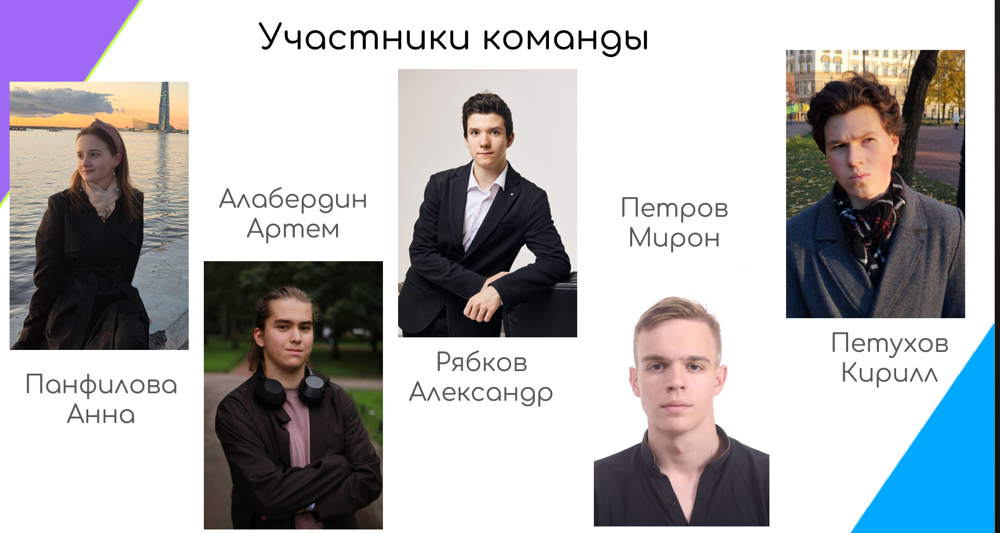
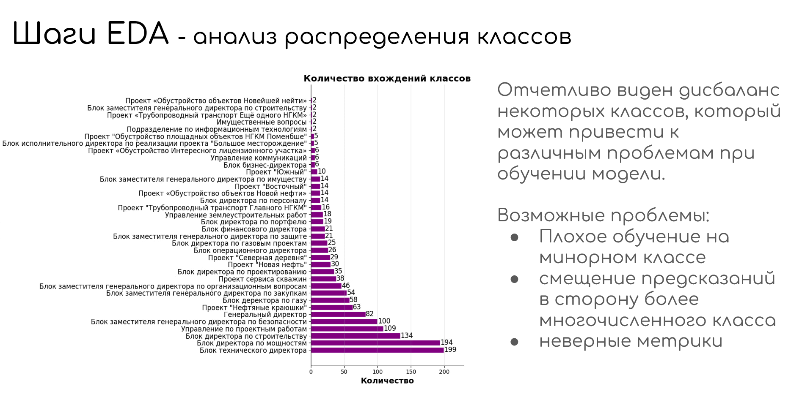

# Учебные достижения

## Успеваемость
- Отличник. По итогам семестра получил автоматические зачеты по всем дисциплинам, включая курс «Тренды ИИ» от Александра Бухановского (вошел в топ 10 из 150+ студентов).
Потверждение в ИСУ: 

## Хакатоны
- **Хакатон от ГПН** – оценка за проект 5.0. Обучение BERT для классификации корпоративных писем.
[GitHub](https://github.com/AR-git-hub/GPN_Hackaton_ARTeam)

## Учебные проекты
### **Веб-приложение для финансового учета с CRM**  
  Руководитель: Жуков Николай Николаевич

  Стек: Flask, HTML/CSS/JS, Jinja2.  
  
  [GitHub](https://github.com/KirillPetukhov1/python_1sem_hakaton?tab=readme-ov-file) 

### **Работа по криптографии** 
Шифры Хилла и кода Хэмминга. Оформление в LaTeX.  

  [PDF отчет](.\materials\pdf\Math.pdf)
  
- **Мегашкола ИТМО. Система генерации Mermaid-кода из диаграмм BPMN/UML**  
  Преобразование изображений бизнес-процессов в код Mermaid и текстовое описание.  

  Руководители: Кугаевских Александр Владимирович, Авдюшина Анна Евгеньевна.

  Стек: Qwen3-VL-2B-Instruct с квантованием, дообучение QLoRA. Сайт: FastAPI, Streamlit. Проект: Docker.  

  *BPMN-диаграмма:* 

  
  
  *Код:* 

  

### **Репозиторий с лабораторными работами по Python**
Решения учебных задач и проектов. Например, сайт для подписки на курсы валют API ЦБ РФ (ЛР7-ЛР9)
  [GitHub](https://github.com/AR-git-hub/ITMO.py)