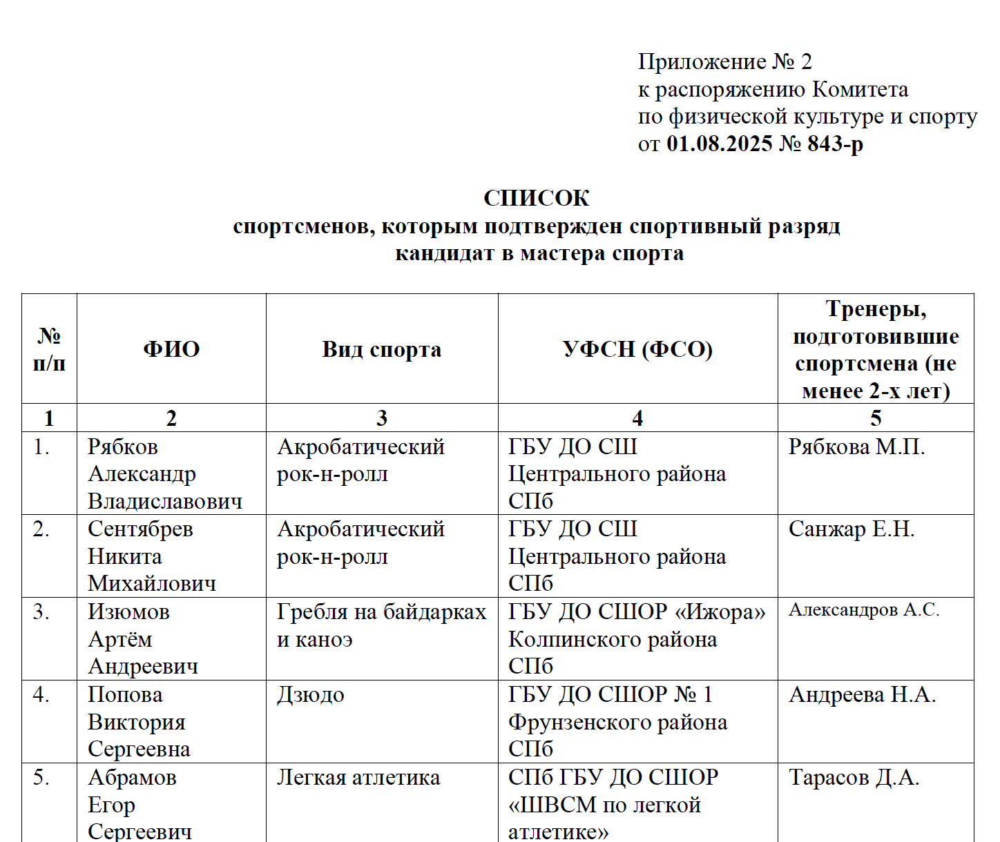

# Культурно-творческие достижения

## Спорт
Кандидат в мастера спорта по акробатическому рок-н-роллу.  
Разряд подтвержден официальным приказом (лето 2026). Активно тренируюсь, участвую в соревнованиях и показательных выступлениях.  

*Превью: *
*Приказ: [приказ](../materials/pdf/Приложение_2_к_распоряжению_КФКиС_от_01_08_2025_843_р_Подтверждение.pdf)*

## Музыкальное творчество
Создание коммерческих фонограмм для спортсменов (акробатический рок-н-ролл): адаптирую и записываю треки под хореографию для музыкального сопровождения выступлений

Веду телеграмм-канал, посвященный музыке, где публикую свои работы

*Ссылка: [телеграмм](https://t.me/ARmusicRnR)*

## Творчество в ИТМО 
Участник в развитии «клуба любителей Minecraft ИТМО» (см. в разделе общественной деятельности). Рассматриваю это, как площадку для развития креативности и командных проектов.