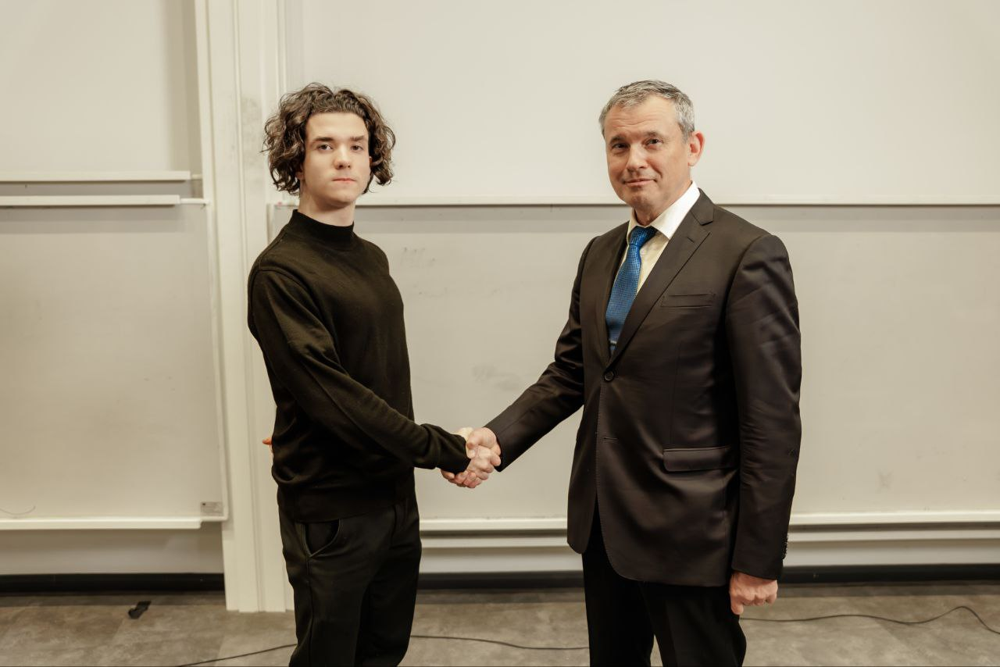
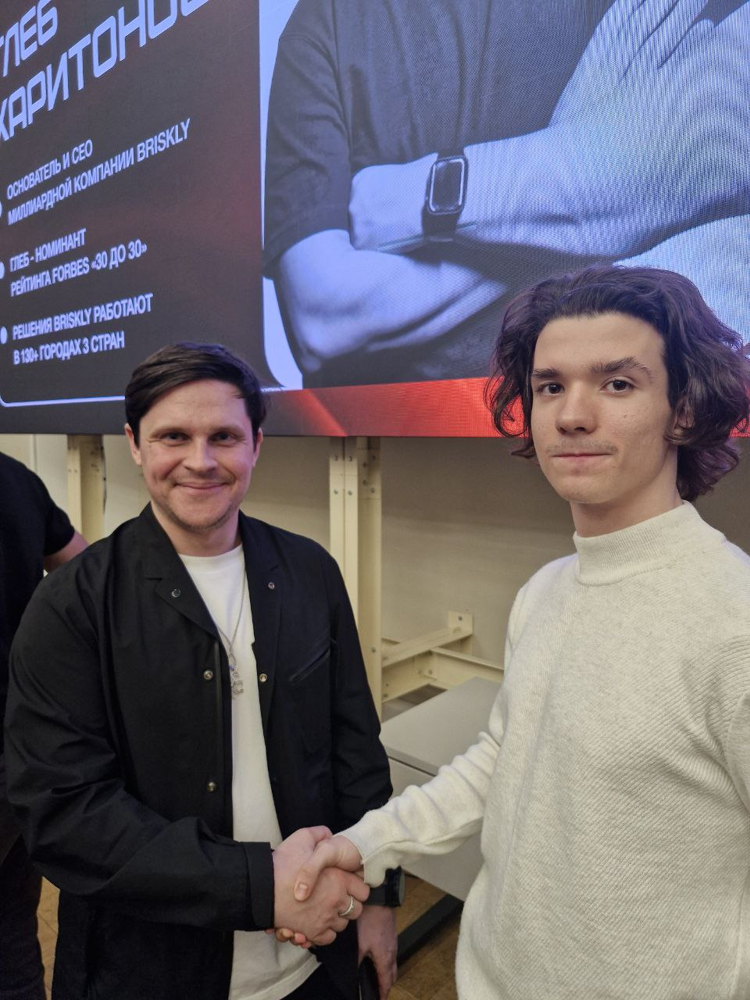
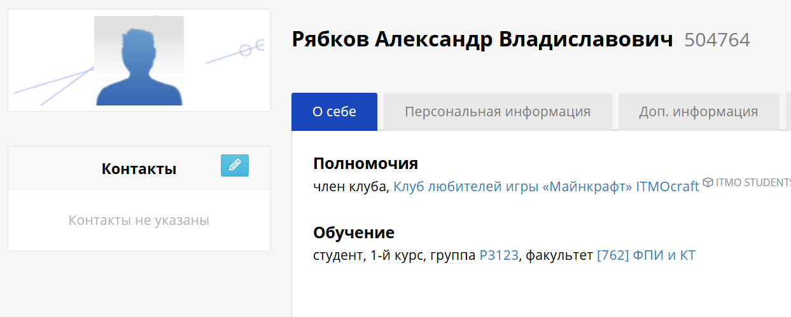

# Общественная и организаторская деятельность

## Участие в студенческих сообществах
- **ITMO BUSINESS COMMUNITY** – член сообщества, участие в нетворкинге, встречи с приглашенными предпринимателями

Альберт Суфияров (CEO "Нева Милк"): 
Глеб Харитонов (CEO "Briskley"): 

- **Клуб любителей Minecraft ИТМО** – активное участие в развитии клуба: организация встреч, привлечение новых участников, проведение игровых сессий и обсуждений 

## Посещение конференций и мероприятий
Регулярное участие в конференциях и митапах, в том числе:

  - Scientific Open Source Meetup
  - Спецтрек ДС – посещение всех встреч и успешное взаимодействие с организаторами спецтрека

## Лидерские позиции
- **Тимлид проекта по разработке сайта для финансового учета с CRM** – управлял процессом создания веб-приложения на Flask, включая backend и frontend. Организовывал работу, контролировал дедлайны, вел коммуникацию

- **Тимлид на хакатоне ГПН** – руководил командой при обучении BERT для классификации корпоративных писем. Координировал задачи, распределял роли, отвечал за итоговую презентацию. Оценка проекта: 5.0 (100 баллов)
[GitHub](https://github.com/AR-git-hub/GPN_Hackaton_ARTeam)

