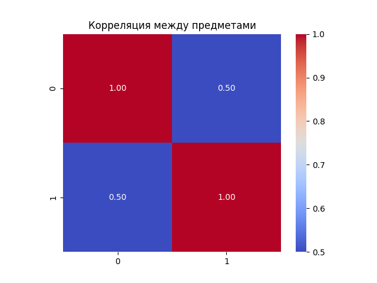
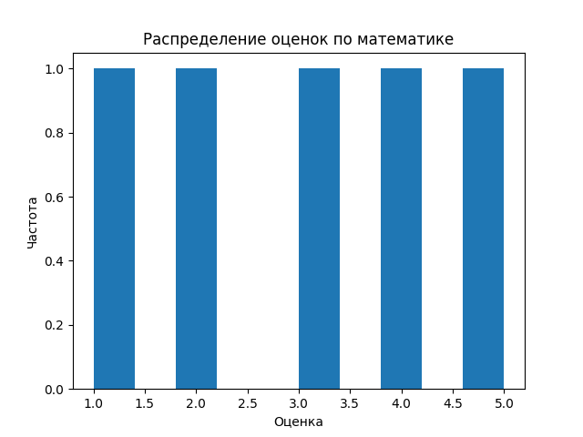
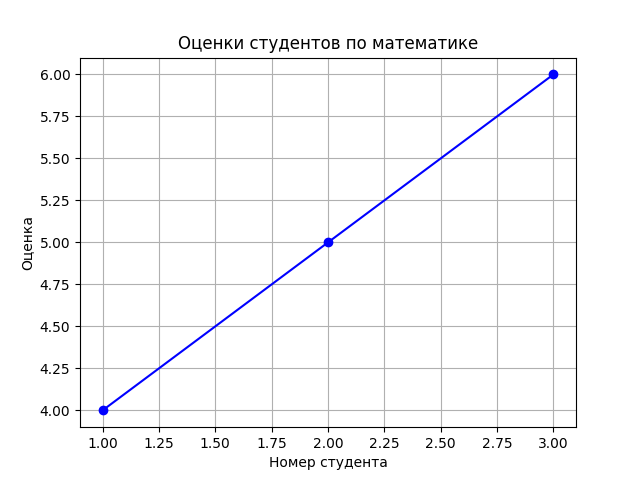

# **Проект 2. NumPy**

## **Цель и описание работы**
- создание и преобразование массивов (arange, reshape, transpose),

- векторные и матричные операции (сложение, умножение на скаляр, поэлементное умножение, скалярное произведение, матричное умножение),

- линейная алгебра (определитель, обратная матрица, решение СЛАУ),

- статистический анализ (среднее, медиана, стандартное отклонение, перцентили, нормализация),

- визуализация данных (гистограмма, тепловая карта корреляции, линейный график).

## **Реализация и Функционал**
### Создание и обработка массивов

- create_vector(n) — генерирует вектор длины n со значениями от 0 до n-1 (используется np.arange)

- create_matrix(shape) — создаёт матрицу заданной формы, заполненную случайными числами из отрезка [0, 1) (np.random.rand)

- reshape_vector(vec, shapes) — изменяет форму массива в соответствии с переданными размерами (np.reshape)

- transpose_matrix(mat) — возвращает транспонированную матрицу (mat.T)


### Векторные и Матричные операции

- vector_add(a, b) — поэлементное сложение (+).

- scalar_multiply(vec, scalar) — умножение вектора на число (*).

- elementwise_multiply(a, b) — поэлементное умножение (*).

- dot_product(a, b) — скалярное произведение (np.dot).

- matrix_multiply(a, b) — матричное произведение (@ или np.matmul).

- matrix_determinant(a) — определитель (np.linalg.det).

- matrix_inverse(a) — обратная матрица (np.linalg.inv).

- solve_linear_system(A, b) — решение системы линейных уравнений (np.linalg.solve).

### Статистический анализ

- load_dataset(path) — загрузка CSV‑файла в массив NumPy через pandas.

- statistical_analysis(data) — вычисление набора статистик (среднее, медиана, стандартное отклонение, минимум, максимум, 25‑й и 75‑й перцентили).

- normalize_data(data) — min‑max нормализация в диапазон [0, 1] с проверкой деления на ноль.

- plot_histogram(data) — гистограмма распределения (с сохранением в plots/histogram.png).

- plot_heatmap(matrix) — тепловая карта корреляции (seaborn.heatmap).

- plot_line(x, y) — линейный график зависимости.

## Нюансы реализации
**Векторизация** — все операции выполнены без явных циклов Python, с использованием встроенных возможностей NumPy, что обеспечивает высокую производительность и читаемость кода.

**Универсальность функций** — create_matrix и reshape_vector сделаны параметризуемыми, что позволяет использовать их для массивов произвольных размеров. Это потребовало адаптации тестов.

**Обработка граничных случаев** — в normalize_data добавлена проверка равенства max и min (для константного массива), чтобы избежать деления на ноль.

**Сохранение графиков** — все изображения сохраняются в папку plots, что позволяет легко интегрировать их в отчёт.

**Тестирование** — для проверки корректности использовался pytest с набором тестов, проверяющих не только возвращаемые значения, но и типы, формы массивов.

## Графики

Тепловая карта корреляций – 

Гистограмма – 

График зависимости – 

## **Организация рабочего пространства и Кодовая база**
```
LR-2/
├── main.py               # основной файл с реализацией функций
├── test.py               # тесты pytest
├── requirements.txt      # зависимости: numpy, pandas, matplotlib, seaborn, pytest
├── data/                 # папка с исходными данными
│   └── students_scores.csv
└── plots/                # папка для сохраняемых графиков (создаётся автоматически)
```

Все функции реализованы в `main.py`, тесты в `test.py`. Для проверки используется `pytest`. Графики сохраняются в папку plots. Датасет с оценками студентов расположен в `data/students_scores.csv`.

## **Выводы и результаты**

В ходе выполнения лабораторной работы были закреплены навыки работы с библиотекой NumPy: создание и преобразование массивов, выполнение векторных и матричных операций, применение функций линейной алгебры, проведение статистического анализа и визуализация данных. Удделено внимание написанию чистого, документированного кода, соответствующего стандартам PEP‑8, и его тестированию с помощью pytest. 


